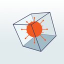

# NO
Contact Tracing - Norway

**Smittestopp** 2 has been developed by NetCompany for the Norwegian Institute of Public Health (FHI). Decentralized solution - based on GAEN Apple&Google Exposure Notifications framework.

Its development begun at the end of September 2020, after that the Norwegian Data Protection Authority (NDPA) stopped former release (read below). Further details [HERE](https://www.fhi.no/en/news/2020/niph-starts-work-on-a-new-solution-for-digital-contact-tracing/).

Since the end of December 2020 it has been released on the iOS & Android app stores.

Play Store | https://play.google.com/store/apps/details?id=no.fhi.smittestopp_exposure_notification
-----------|--------------------------------------------------------------------
Sources & Documentation | https://github.com/folkehelseinstituttet
Website | https://www.helsenorge.no/en/smittestopp/
Website | https://www.fhi.no/om/smittestopp/
Stats | https://www.fhi.no/om/smittestopp/nokkeltall-fra-smittestopp/

- APKLAB Analysis

Build | Link
------|-----
3.0 #38 | https://apklab.io/apk.html?hash=ad0448b1afe16d994439010ed1439a5a2339dbd4d89b972d2298a6b806d1861f

- JoeSandbox Report

Build | Link
------|-----
3.0 #38 | https://www.joesandbox.com/analysis/427092/1/html

-----------------------------------

**Smittestopp** 1 has been developed by Simula for the Norwegian Institute of Public Health (FHI). Centralized solution. It relies on proximity tracing (via Bluetooth) + device location on demand (GPS). When user doesn't enable GPS location, app works in 'partial activation' mode.

App requests also to register the phone number on FHI portal. However, such registration isn't compulsory since app can work in 'partial activation' mode.

According to FHI public stats, the number of active users as of 5 May 2020 is 749365. Only 32711 are using the app in 'partial activation' mode.

**On June 15th the Norwegian Institute of Public Health (FHI) received a notification from the Norwegian Data Protection Authority (NDPA) imposing a temporary ban on processing personal data collected by the app.**

**Since June 16th data will no longer be collected from the app. Personal data stored in the central database will be deleted as soon as possible. Further details [HERE](https://www.fhi.no/en/news/2020/niph-stops-collection-of-personal-data-in-smittestopp/).**

Play Store | https://play.google.com/store/apps/details?id=no.simula.smittestopp
-----------|--------------------------------------------------------------------
Website | https://helsenorge.no/coronavirus/smittestopp
Website | https://www.fhi.no/sv/smittsomme-sykdommer/corona/bruk-av-smittestopp/
Stats | https://www.fhi.no/sv/smittsomme-sykdommer/corona/nokkeltall-fra-smittestopp/
Simula FAQ | https://www.simula.no/news/digital-contact-tracing-qa

__The source code hasn't been released by Simula. However, owing to security & privacy issues with first releases, some researchers have decompiled the app & published the reversed code on Github.__

- APKLAB Analysis

Build | Link
------|-----
1.1.2 #1026 | https://apklab.io/apk.html?hash=cc9fefb17bb1caa327a89b796cebe7b139408c1ea57f7065820e7a9e1ba13dfb

- JoeSandbox Report

Build | Link
------|-----
1.1.2 #1026 | https://www.joesandbox.com/analysis/228621/0/html
